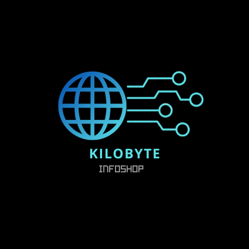
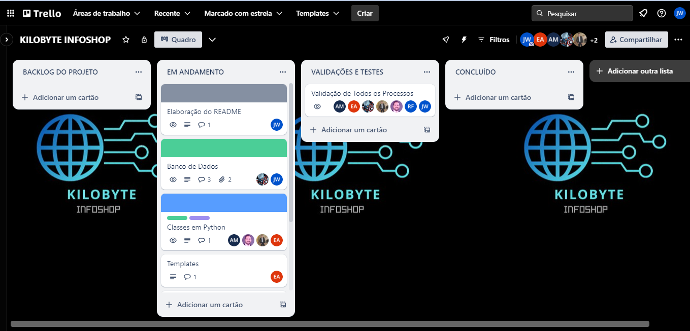

# KILOBYTE INFOSHOP

  

Bem-vindo ao repositório oficial do projeto Kilobyte Infoshop!
Este projeto é dedicado à construção de uma plataforma web, que é integrada via API'S, proporcionando uma experiência aprimorada para os clientes ao gerenciar informações relacionadas aos produtos, pedidos e muito mais.

# Visão Geral

A infraestrutura da API foi construída utilizando o MySQL como banco de dados principal, garantindo a eficiência e confiabilidade no armazenamento e recuperação de dados. O back-end da aplicação foi desenvolvido em Python, uma linguagem conhecida por sua legibilidade e versatilidade, proporcionando uma base sólida para a implementação de funcionalidades avançadas.

# Metodologia Ágil - Kanban

Para garantir um desenvolvimento eficiente e flexível, adotamos a metodologia ágil com ênfase no framework Kanban. Esta abordagem permite uma gestão transparente e contínua do fluxo de trabalho, proporcionando uma visão clara das tarefas em andamento, pendentes e concluídas. O uso do Kanban nos ajuda a adaptar e priorizar as atividades de forma dinâmica, otimizando o processo de desenvolvimento.

  

# Plataforma Kilobyte Infoshop - Administração

Bem-vindo à tela inicial, a porta de entrada para a experiência administrativa de excelência! Nossa página inicial foi projetada para capacitá-lo a gerenciar eficientemente todos os aspectos do seu domínio administrativo. Com uma interface intuitiva e funcionalidades objetivas.

  

# Plataforma Kilobyte Infoshop - Cadastro de Produtos

Bem-vindo à tela de Cadastro de Produtos, sua ferramenta completa para inserir e gerenciar os produtos em seu catálogo de maneira eficiente e visualmente atrativa. Aqui, simplificamos o processo de criação, garantindo que cada detalhe essencial seja capturado para apresentar seus produtos da melhor maneira possível.
Insira o nome exclusivo do seu produto, destacando suas características distintivas, especifique o preço do produto, garantindo uma comunicação clara e transparente com seus clientes e Conte a história do seu produto. Destaque recursos, benefícios e informações importantes para envolver seus clientes.
Adicione uma imagem para proporcionar uma experiência visual impactante. Faça upload de fotos de alta qualidade que destaquem a estética e os detalhes do produto.

  

# Plaforma Kilobyte Infoshop - Gerenciamento de Usuários

Bem-vindo à nossa página dedicada aos dados cadastrais dos clientes! Aqui, fornecemos uma visão abrangente e organizada das informações essenciais para uma gestão eficiente. 

## Veja como utilizar cada recurso:

Nome, Nascimento e Contato:
Encontre o nome completo do cliente, sua data de nascimento e informações de contato, incluindo número de telefone e e-mail. Esses detalhes são cruciais para personalizar e aprimorar o atendimento.

Documentação Pessoal:
Visualize de forma segura a identidade do cliente através dos campos de Identidade (RG) e CPF. Esses dados são protegidos com medidas robustas de segurança para garantir a confidencialidade.

Endereço Residencial:
Conheça o endereço do cliente com detalhes específicos, como CEP, rua, município e estado. Essas informações são valiosas para envios, correspondências e estratégias de logística.

Complemento:
O campo de complemento permite adicionar informações adicionais sobre o endereço, garantindo uma precisão ainda maior.
Utilizando a Pesquisa:

No canto superior direito da página, você encontrará um campo de pesquisa. Use-o para localizar rapidamente um cliente específico. Insira o nome, CPF, ou qualquer outro dado relevante, e nossa ferramenta inteligente encontrará correspondências em tempo real.

## Observação:
Os dados utilizados para visualizão desta experiencia são meremente ilustrativos. 

  

